# Chain of Custody

**A 10-minute cyber check-up that tells small food and trucking businesses the two things to fix first, and lets them prove it to their partners.**

Built in 48 hours at the Brampton SecOps Hackathon (TMU Rogers Cybersecure Catalyst, September 2026).

- **Live app:** https://secops-hackathon-production.up.railway.app
- **Sample report (no sign-up):** https://secops-hackathon-production.up.railway.app/?demo
- **What a partner sees:** https://secops-hackathon-production.up.railway.app/?share=demo-peel-valley

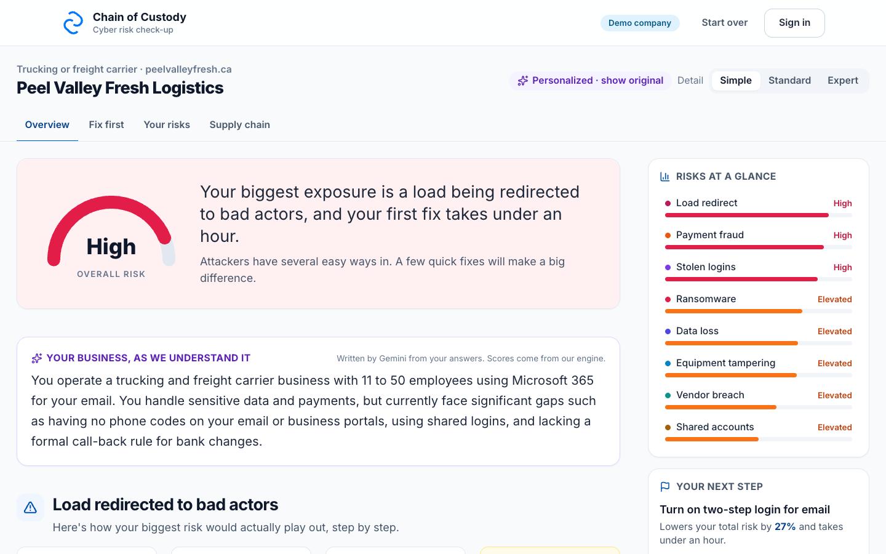

## The problem

Picture a dispatcher at a 25-person refrigerated carrier in Brampton. An email arrives in a real thread with their broker: "New delivery address for tomorrow's load." The broker never sent it. The dispatcher's mailbox was compromised weeks ago, so the bad actors could read the shipment history and pick a valuable load. One person changes the address, alone, and a trailer of groceries goes to bad actors.

Phishing is the way in. The loss happens because one person can change a load with nobody checking.

Small farms, food processors, cold-storage sites, carriers and brokers keep food moving, but most have no IT person and no security budget. Generic checklists give them twenty things to do. Chain of Custody gives them the two that matter most for their business, in plain language, and a way to show their customers they did them.

## What it does

### 1. A short, plain-language check-up

Start with a 5-minute quick check or the full check-up (31 questions, about 12 minutes). There's no account to create, and your answers aren't stored unless you save or share them.

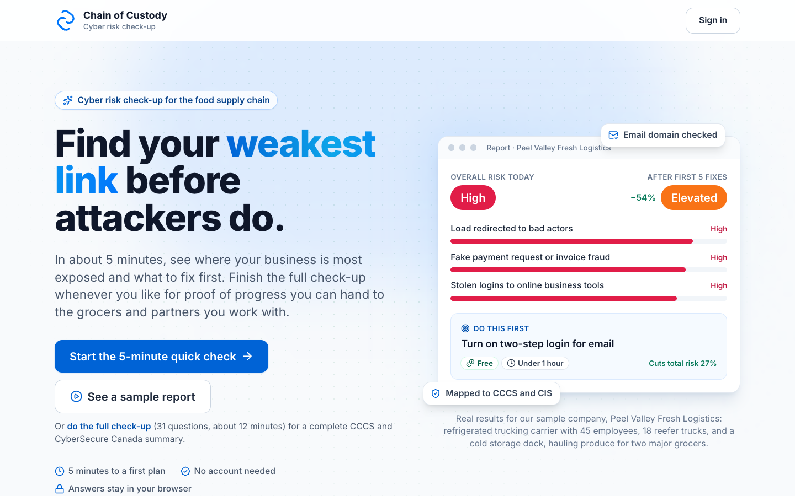
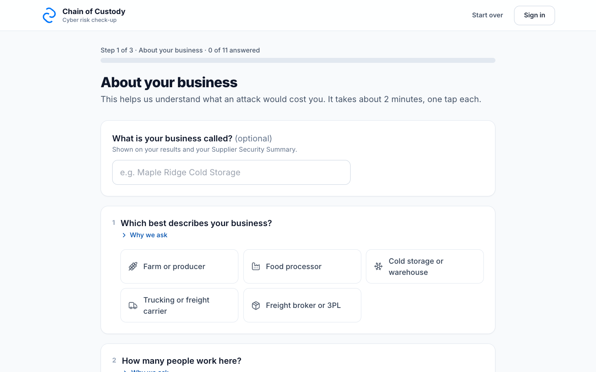

### 2. Your risks, ranked for your kind of business

Eight threats are scored for your business, from redirected loads and invoice fraud to ransomware and tampered equipment. Each one shows how it would actually happen to you, step by step.

The same answers give different priorities for different businesses. For a carrier, the top risk is a redirected load. For a cold-storage site, it's their connected equipment.

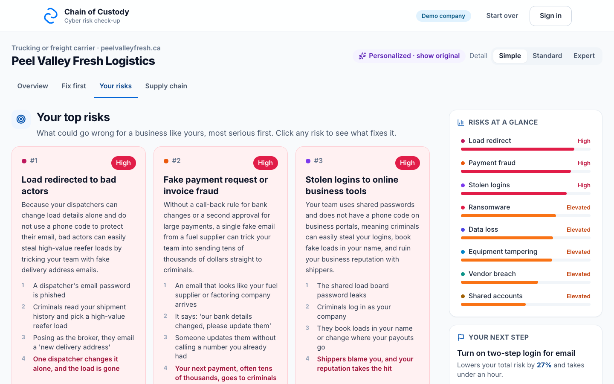

### 3. Fix first: at most five fixes, ranked by risk removed per unit of effort

Each fix shows how much it lowers your total risk, what it costs and how long it takes. **Walk me through it** goes one step at a time, with the exact buttons for Microsoft 365 or Google Workspace and, for common fixes, a link to the vendor's official guide. **Mark as done** re-scores your risk on the spot.

Fixes that are rules people follow, like "call back before any load change", come with a one-page sign to print and post at the dispatch desk.

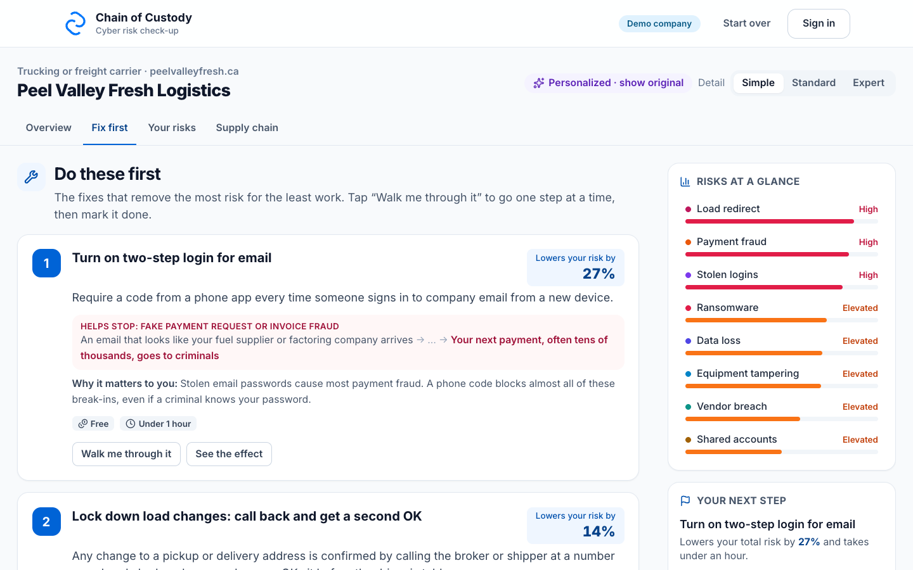
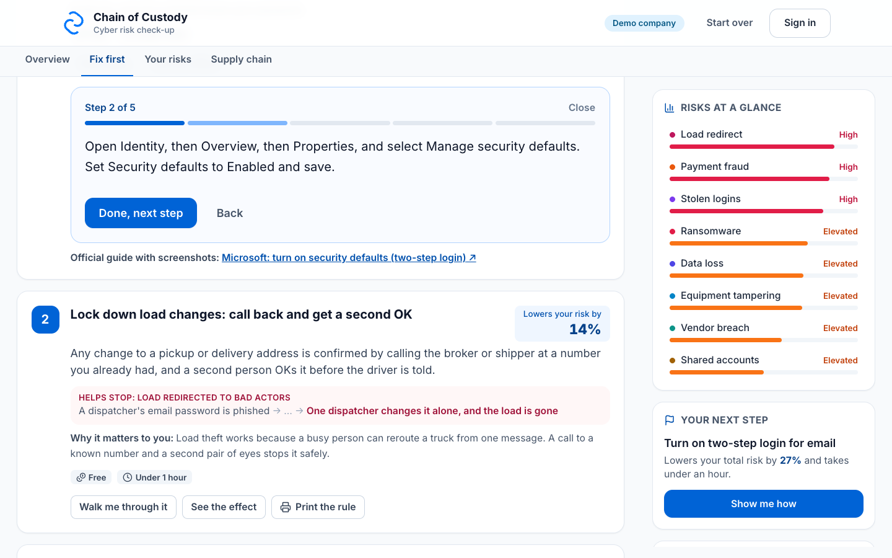

### 4. See how your gaps reach your customers

A risk-flow diagram traces each security gap to the threat it enables and to the partners who feel it: loads delivered to bad actors, spoiled shipments, fraudulent invoices in your name.

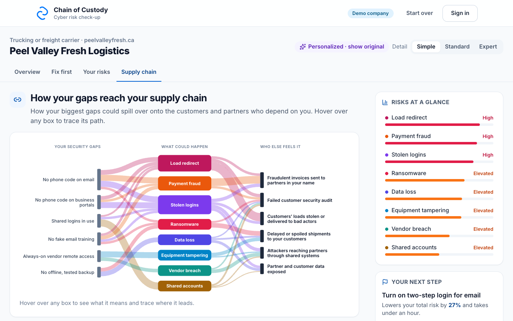

### 5. Invite your suppliers, and see the whole chain

Invite a supplier with a link and a 6-digit PIN. They complete the same check-up and choose what you see: their score, their report, or both. The chain can be up to four tiers deep, and the graph shows where the weakest link is.

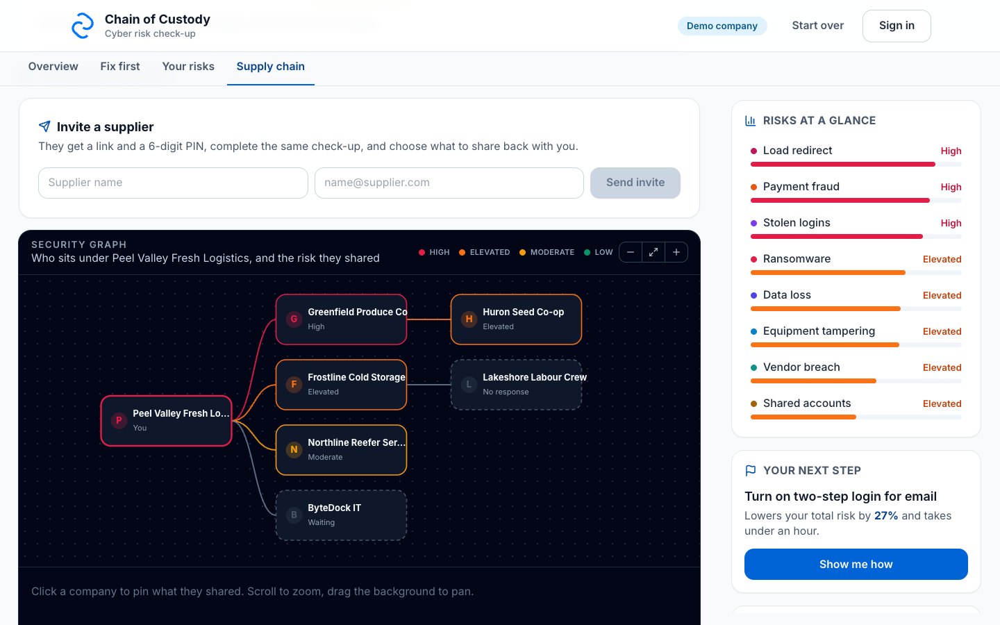

### 6. Proof a partner can open

Share a read-only summary with a broker or grocery customer. The link is locked with a passphrase and expires after 90 days. It includes our own check of the business's email settings (SPF and DMARC, looked up by our server from public DNS), so it isn't only self-reported. Raw answers are never shared.

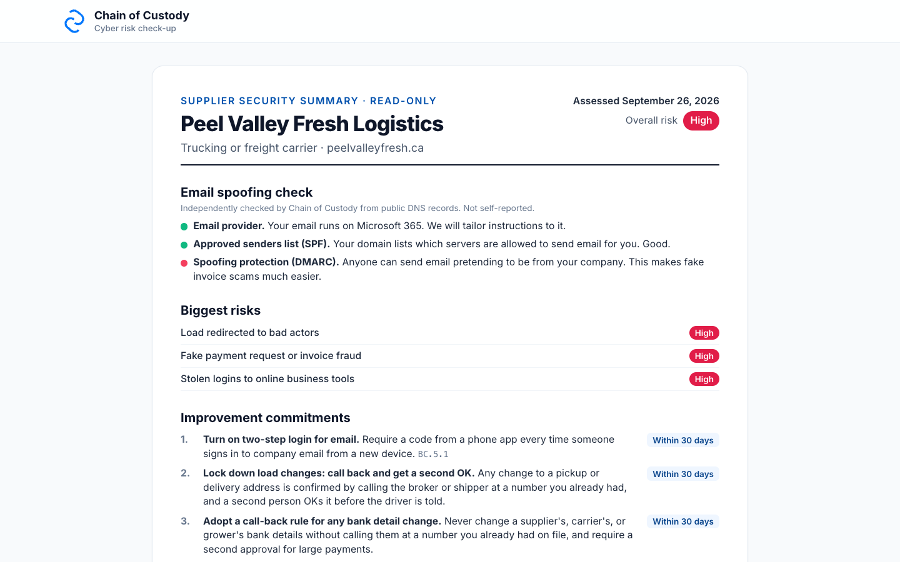

### 7. Mapped to Canadian standards

The Supplier Security Summary maps the results to the Canadian Centre for Cyber Security (CCCS) Baseline Controls plus CIS Controls v8.1, or to CyberSecure Canada (CAN/CIOSC 104). You can print it, save it as a PDF, or download a risk register as a CSV.

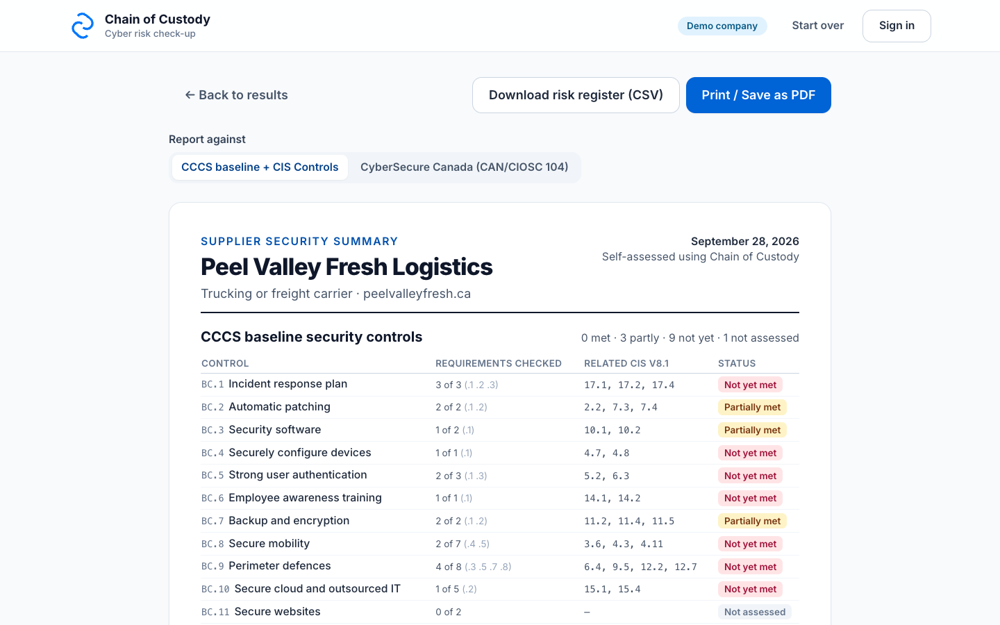

### 8. Plain-language answers about your own report

Choose Simple, Standard or Expert, and the wording adapts to you. A chatbot answers questions about your results. Neither can change a score.

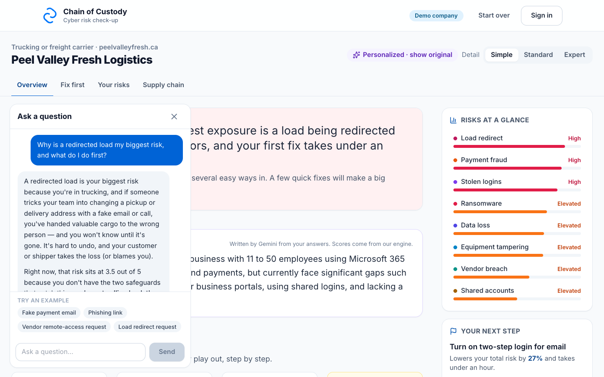

## How the scoring works

**The engine decides; AI only rewords.**

- **Risk = Likelihood × Impact** for each of 8 threat scenarios.
  - **Likelihood** starts from a base rate for your sector (carrier, broker, cold storage, processor or farm). Each protection you have in place lowers it.
  - **Impact** starts at 2, and business facts raise it: perishable goods, losses within hours of downtime, weekly bank transfers, or handling other people's loads.
- **Priority = risk removed ÷ effort.** The engine re-scores all 8 threats with each fix applied and keeps the top five.
- **Every number traces back to an answer.** Scoring is pure TypeScript in the browser, with 197 automated tests: the same answers always give the same ranking.
- **AI guardrail.** Gemini rewrites the results at three reading levels. It never receives the company name or domain. The server rejects any reply that reorders the fixes, adds or drops one, includes a link, or contains a number the engine didn't supply, and the app falls back to the engine's own wording.

The content lives in [`BE/app/catalog/`](BE/app/catalog/) as JSON: questions, fixes, threats, weights and standards mappings. You can retune any weight without touching code. The details are in [FE/README.md](FE/README.md).

## Architecture

```
Browser (React + TypeScript, Vite)          Server (FastAPI, Python)            Supabase Postgres
  scoring engine, runs on the device   ──►   catalog, share links, DNS check,   ──►  assessments, dns_checks,
  Zustand + TanStack Query                   supplier invites, Gemini wording,       ai_texts, supplier_invites,
                                             chatbot (Gemini → Claude fallback)      catalog.* (RLS on, no policies)
```

- **Resilient by design.** If the server is down or slower than 6 seconds, the app boots from a bundled copy of the catalog and the check-up still works. Sharing, invites and AI wording need the server.
- **Locked-down data.** Every table has row-level security on with no policies, so Supabase's public API sees nothing and only our server can read it. Share passphrases and invite PINs are stored only as hashes.
- **Optional sign-in.** Supabase magic-link sign-in lets you save results. The app works fully without it.

| Folder | What's in it |
| --- | --- |
| [`FE/`](FE/README.md) | Web app: questionnaire, results, scoring engine (`src/engine/`), share and invite screens |
| [`BE/`](BE/README.md) | API: catalog, assessments and share links, DNS check, invites, Gemini personalization, chatbot |
| [`BE/app/catalog/`](BE/app/catalog/) | All tunable content (edit these, then run `npm run sync:catalog` in `FE/`) |
| [`docs/screenshots/`](docs/screenshots/) | The screenshots in this README |

## Run it locally

You need Node 20+, Python 3.12+ with [uv](https://docs.astral.sh/uv/), and Docker for a local Postgres.

```bash
# Database
docker run -d --rm --name coc-pg -e POSTGRES_PASSWORD=pg -p 55432:5432 postgres:17

# Server (in BE/): applies the schema, loads the catalog and seeds the demo company on startup
DATABASE_URL=postgresql://postgres:pg@localhost:55432/postgres \
FRONTEND_URL=http://localhost:5173 \
uv run uvicorn app.main:app --port 8766

# Web app (in FE/): run it on port 5173, which the server allows for CORS
npm install
VITE_API_URL=http://localhost:8766 npx vite --port 5173
```

Open http://localhost:5173/?demo for the sample company.

Add `GEMINI_API_KEY` to the server's environment for AI wording and the chatbot. Without it, the app shows the engine's own wording.

**Tests:**

```bash
cd FE && npx tsc -b && npm test
cd BE && DATABASE_URL=postgresql://postgres:pg@localhost:55432/postgres uv run pytest -q
```

## Deploy your own copy

The live instance runs on a teammate's Railway account. To stand up an independent copy:

1. **Database.** Create a Supabase project. Copy its **session pooler** connection string (the direct connection is IPv6-only). The server creates the tables itself on first start.
2. **Server.** Deploy `BE/` as a service with the start command `uvicorn app.main:app --host 0.0.0.0 --port $PORT` and the health check `/api/health`. Set these environment variables:

   | Variable | Needed for |
   | --- | --- |
   | `DATABASE_URL` | Required. The Supabase session pooler URL |
   | `FRONTEND_URL` | Required. The web app's URL, used for CORS and for share and invite links |
   | `GEMINI_API_KEY` | AI wording and the chatbot |
   | `PERSONALIZE_MODEL` | Optional. The model for AI wording (default `gemini-3.5-flash-lite`) |
   | `GEMINI_MODEL` | The chatbot's model. It must be a real model name, or the chatbot always falls back to Claude |
   | `ANTHROPIC_API_KEY`, `ANTHROPIC_MODEL` | The chatbot's Claude fallback |
   | `SUPABASE_URL`, `SUPABASE_PUBLISHABLE_KEY` | Optional. Saved results for signed-in users |
   | `BREVO_API_KEY`, `BREVO_SENDER_NAME`, `BREVO_SENDER_EMAIL` | Optional. Emails supplier invites; without them, the PIN is shown to the buyer to pass on |

3. **Web app.** Deploy `FE/` as a static site: build it with `npm run build` and serve `dist/`. Set `VITE_API_URL` to the server's URL **before building**, because Vite bakes it in at build time. For sign-in, also set `VITE_SUPABASE_URL` and `VITE_SUPABASE_PUBLISHABLE_KEY`, and add the web app's URL to Supabase Auth's redirect URLs. Error reporting goes to the Sentry project set in `FE/src/main.tsx`; change the DSN to your own.
4. **Warm the demo.** Open `/?demo` at Simple, Standard and Expert once, so the AI wording for the sample company is cached and the demo works even when the AI is slow.

Never commit keys. Set them only in your host's environment settings.

## Team

- **Satvik Kaul:** backend, AI integration and the fixes
- **Nima Bargestan:** frontend, the assessment and scoring calibration
- **Hala Alshareef:** report chatbot, sign-in, error monitoring and supplier invites
